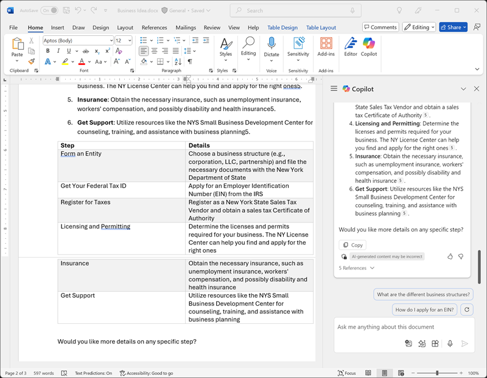
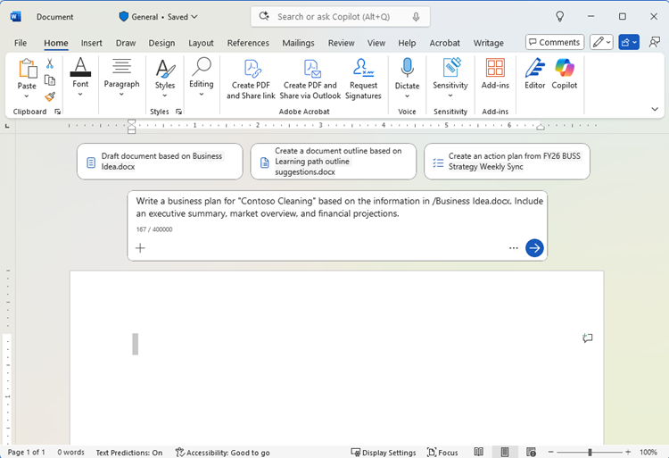

---
lab:
  title: Microsoft 365 Copilot 살펴보기
---
# Microsoft 365 Copilot 살펴보기

Microsoft 365 Copilot의 흥미로운 세계에 오신 것을 환영합니다!

이 연습에서는 Copilot의 힘을 활용하여 회사 청소 기업을 시작하기 위한 새로운 비즈니스 아이디어를 살펴봅니다.

어디서나 사무실 공간에 혁명을 일으킬 최고 수준의 청소 서비스를 시작하려는 상황이라고 상상해 보십시오. Microsoft Copilot을 통해 시장 추세를 연구하고 견고한 비즈니스 플랜을 개발할 수 있습니다. 그것이 전부가 아닙니다. 또한 흥미로운 문서, 눈길을 끄는 프레젠테이션, 설득력 있는 이메일을 만들어 아이디어를 얻고 투자자를 유치할 수 있습니다.

이 매력적인 대화형 랩을 통해 탐색해 나가며 창의력과 비즈니스 통찰력을 발휘할 준비를 할 수 있습니다. 이 연습이 끝나면 기업가적 성공의 길을 열어줄 포괄적인 자료 세트를 갖추게 됩니다. 회사 청소 기업을 현실로 만들어 보겠습니다!

이 연습을 완료하는 데 약 **40**분 정도 소요됩니다.

> **참고**: 이 연습을 수행하려면 조직의 **Microsoft 365 Copilot** 라이선스가 필요합니다.

## Copilot을 사용하여 문서 탐색 및 아이디어 조사

생성형 AI 탐색을 시작하려면 Word용 Copilot을 사용하여 기존 문서를 검사하고 여기에서 몇 가지 인사이트를 추출해 보겠습니다.

1. 웹 브라우저에서 `https://github.com/MicrosoftLearning/mslearn-copilot/raw/main/Allfiles/Business%20Idea.docx`에 있는 [Business Idea.docx](https://github.com/MicrosoftLearning/mslearn-copilot/raw/main/Allfiles/Business%20Idea.docx) 문서를 엽니다. 
1. **다운로드** 폴더에 파일을 다운로드합니다. 그런 다음 웹 브라우저를 닫습니다.
1. 방금 다운로드한 문서를 **OneDrive** 폴더로 **이동**하거나 **복사하여 붙여넣습니다**.
1. **OneDrive** 폴더에서 Microsoft Word의 **Business Idea.docx**를 열고(새로운 기능에 대한 환영 메시지 또는 알림을 닫음), 뉴욕시의 청소 사업에 대한 몇 가지 개략적인 아이디어를 설명하는 문서를 검토합니다. 메시지가 표시되면 상단에서 **편집 사용**을 선택합니다.

    > **팁**: **Navigation** 창이 열려 있는 경우 창을 닫고 문서를 더 많이 볼 수 있습니다.

1. 다음과 같이 Word 도구 모음에서 **Copilot** 아이콘을 찾아 선택하여 Copilot 창을 엽니다(시각적 테마는 다를 수 있음).

    

1. Copilot 창의 하단 텍스트 영역에 다음 프롬프트를 입력합니다.

    ```prompt
    Summarize this document into 5 key points, and suggest next steps.
    ```

1. 다음과 같이 문서의 주요 사항을 요약하는 Copilot의 응답을 검토합니다.

    

    > 표시되는 구체적인 응답은 생성형 AI의 특성에 따라 달라질 수 있습니다.

    Copilot으로 몇 가지 유용한 지침을 얻게 되었길 바랍니다. 추가 질문이 있는 경우, 더 구체적인 정보를 요청할 수 있습니다.

1. Copilot 창으로 돌아가서 Copilot에게 다음 질문을 합니다.

    ```prompt
    How do I setup a new business in New York? Answer with a numbered list.
    ```

1. 응답을 검토하고 필요에 따라 추가 질문을 합니다. 응답이 만족스러우면 응답 아래에 있는 **복사**(&#128461;) 아이콘을 사용하여 응답을 클립보드에 복사합니다. 기존 텍스트 뒤의 Word 문서에 붙여넣습니다. 그런 다음 뉴욕에서 비즈니스를 설정할 때 수행할 작업 목록을 제공하는 텍스트를 선택하고 선택한 텍스트의 맨 아래에 있는 Copilot 아이콘을 사용하여 텍스트를 표로 시각화합니다.

    

1. 표를 검토하고 Copilot에게 자세한 내용을 참고할 수 있는 열과 같은 추가 정보를 추가하도록 요청합니다.  응답은 다음과 같아야 합니다(**다시 생성** 단추를 사용해야 할 수도 있음).

    

    > **중요**: AI가 생성한 응답은 웹에 공개된 정보를 기반으로 합니다. 사업체를 설립하는 데 필요한 단계를 이해하는 데 도움이 될 수 있지만 100% 정확하다고 보장할 수 없으며 전문적인 조언의 필요성을 바꿀 수는 없습니다!

1. Copilot이 생성한 표에 만족하면 **보관** 옵션을 선택합니다.

## Copilot을 사용하여 사업 계획용 콘텐츠 만들기

이제 몇 가지 초기 조사를 완료했으므로 Copilot을 통해 청소 회사를 위한 사업 계획을 작성해 보겠습니다.

1. **Business Idea.docx** 문서가 열려 있는 상태에서 Copilot 창에 다음 프롬프트를 입력합니다.

    ```prompt
    Can you suggest a name for my cleaning business?
    ```

1. 제안 사항을 검토하고 청소 회사의 이름을 선택해 줘(그렇지 않으면 원하는 회사 이름을 찾으라는 제안 메시지를 계속 표시해 줘).
1. 새 빈 문서 만들기 그런 다음 새 문서에서 여백에 있는 Copilot 아이콘을 선택하여 새 콘텐츠 초안을 작성합니다. 다음 프롬프트를 입력하고 **Contoso Cleaning**을 원하는 회사 이름으로 바꿉니다.

    ```prompt
    Write a business plan for "Contoso Cleaning" based on the information in /Business Idea.docx. Include an executive summary, market overview, and financial projections.
    ```

    

    > **팁**: 프롬프트를 입력한 후 "/" Copilot을 입력하면 OneDrive 폴더의 문서를 찾아볼 수 있습니다. Copilot에서 문서를 제안하지 않으면 OneDrive가 아직 완전히 인덱싱되지 않았기 때문일 수 있습니다. 이 경우 프롬프트를 `Write a business plan for "Contoso Cleaning", a commercial cleaning buisness in New York. Include an executive summary, market overview, and financial projections.`로 수정합니다.

1. 응답을 생성하고 검토합니다. 그런 다음 그대로 두고, 톤과 길이를 조절하거나 Copilot에게 새 프롬프트로 다시 쓰도록 요청합니다. OneDrive 폴더에 **Business Plan.docx** 이름으로 저장하기 전에 문서에 적절한 제목과 스타일을 적용하여 전문적인 느낌을 더합니다. 해당 문서는 다음과 비슷합니다.

    

## Copilot for Excel에서 재무 계획 시각화

사업 계획이 준비되어 있으면 재무 계획에 대한 데이터 중 일부를 선택하고 Excel의 Copilot에 해당 데이터를 시각화하도록 요청하여 투자자에게 보여 줄 이메일 또는 프레젠테이션에 포함시킬 수 있습니다.

1. Microsoft Word에 **Business Plan** 문서가 열려 있는 상태에서 Copilot 창을 엽니다.
1. 생성된 비즈니스 플랜에 예상 수익 목록이 포함된 경우 다음 프롬프트를 입력합니다.

    ```prompt
    Create a table of the projected profits in this document.
    ```

    그렇지 않으면 아래 프롬프트를 입력합니다.

    ```prompt
    Create a table of projected profits for the next 5 years, starting with this year. The profit this year should be $10,000 and it should increase by 12% each year.
    ```

1. 예상 수익 테이블을 클립보드에 복사합니다.
1. **Excel**을 열고 새 빈 통합 문서를 만듭니다. 통합 문서를 **Financial Projections.xlsx**로 OneDrive 폴더에 즉시 저장합니다.
1. 수익 예측 테이블을 Excel 스프레드시트에 붙여넣고 **서식을 테이블로 지정합니다**. 방법:
    1. 데이터 내에서 **셀**을 선택합니다.
    1. **홈**을 선택하고 스타일 아래에서 **표 형식**을 선택합니다. 
    1. 표 스타일을 선택합니다.
    1. **표 만들기** 대화 상자에서 셀 범위를 확인하거나 설정합니다.
    1. 표에 헤더가 있는지 표시하고 **확인**을 선택합니다.
1. 판매 예측을 테이블 형식으로 지정한 상태에서 Excel 리본의 **홈** 탭에서 Copilot 창을 열고 다음 프롬프트를 입력합니다.

    ```prompt
    Suggest ways to visualize these financial projections.
    ```
    
1. Copilot은 데이터를 시각화하는 방법을 제안하고 피벗 차트를 새 시트에 추가할 것을 제안해야 합니다.

    

    > **팁**: Copilot이 데이터에 대해 다른 형식을 제안하는 경우 후속 프롬프트 `Visualize the data as a line chart.`를 입력합니다.

1. Copilot 응답에서 옵션을 선택하여 피벗 차트를 새 시트에 추가하고 엽니다. 차트를 선택한 다음 **디자인**을 선택하여 스타일을 적용하고 차트 종류 및 기타 작업을 변경합니다. 결국에는 다음과 유사한 것이 있어야 합니다.

    

1. 통합 문서를 저장하고 Excel을 닫습니다.

방금 Word의 Copilot에서 만들어진 데이터를 사용하여 Excel에서 시각화했습니다. 다음 연습에서는 Outlook의 Copilot을 사용하여 수행한 작업에 대한 이메일을 작성하고 보내는 방법을 살펴보겠습니다.

## Copilot을 사용하여 프레젠테이션용 콘텐츠 만들기

Copilot의 도움으로 청소 비즈니스 아이디어에 대한 비즈니스 플랜 초안을 작성하고 몇 가지 재무 계획을 준비해 보았습니다. 이제 비즈니스의 혜택을 전달하기 위한 효과적인 프레젠테이션이 필요합니다.

1. **PowerPoint**를 열고 **비어 있는 프레젠테이션**을 새로 만듭니다. **디자이너** 창이 자동으로 열리면 닫습니다.
1. 프레젠테이션을 OneDrive 폴더에 **Cleaning Company.pptx**로 저장합니다.
1. 리본의 **홈 탭**에서 **Copilot 단추**를 선택하고 **프레젠테이션 만들기**를 선택한 후 다음과 같이 Copilot 창에서 프롬프트를 완료합니다.

    ```prompt
    Create a presentation about a corporate cleaning service named "Contoso Cleaning" in New York City. The presentation should include the benefits of using a professional cleaning business.
    ```

1. Copilot은 프레젠테이션에서 슬라이드를 생성합니다.  이 프로세스는 몇 분 정도 걸릴 수 있으며 출력은 다른 테마로 다음과 같아야 합니다.

    

1. 프레젠테이션에서 두 번째 마지막 슬라이드(Copilot이 생성한 경우 최종 *결론* 슬라이드 앞)를 선택합니다. 그런 다음, Copilot 창의 채팅 상자에서 **프롬프트 보기** 아이콘을 선택하고 **... 관련 슬라이드 추가** 프롬프트를 선택하여 `Add a slide about the benefits of an eco-friendly approach to cleaning.` 프롬프트를 사용한 새 슬라이드를 만듭니다.

    

1. 프레젠테이션을 저장하고 PowerPoint를 닫습니다.

## Copilot을 사용하여 자금 조달 회의 주선

비즈니스를 시작하는 데 도움이 되는 몇 가지 참고 자료를 만들었습니다. 이제 스타트업 자금을 제공하려는 투자자에게 연락할 시간입니다.

1. **Outlook**을 열고 제목 표시줄에서 **Copilot** 아이콘을 사용하여 Copilot 창을 엽니다.
1. **일정** 페이지로 전환하고 보기를 **작업 주**로 변경합니다. 이번 주 일정에 예약된 이벤트가 아직 없는 경우에는 Copilot에서 작업에 사용할 정보를 제공하기 위해 이벤트를 몇 개 추가할 수 있습니다.
1. Copilot 창에서 다음 프롬프트를 입력합니다.

    ```
    What events do I have scheduled this week?
    ```

    Copilot은 이번 주에 예약된 이벤트를 요약하여 응답할 것이며, 이를 통해 스타트업 자금 조달을 위한 은행 지점장과의 모임에 참석할 시간이 되는지 파악할 수 있습니다.

1. **메일** 페이지로 전환하여 새 이메일을 만들고 **받는 사람** 상자에 사용자의 이메일 주소를 입력합니다.
1. **Copilot으로 작성된 초안** 옵션을 선택합니다.

    
    
1. 다음 프롬프트를 입력하여 초안 이메일을 생성합니다.

    ```prompt
    Write an email to a bank manager requesting a meeting to discuss funding for a commercial cleaning business. The email should be concise and the tone should be professional.
    ```

1. Copilot을 사용하여 이메일 콘텐츠를 구체화한 다음 **유지**를 선택하여 메시지를 마무리합니다.

    

1. 원하는 경우 이메일을 자신에게 보내도 됩니다.

## 과제

이제 Microsoft 365 Copilot을 사용하여 아이디어를 조사하고 콘텐츠를 생성하는 방법을 확인했습니다. 더 자세히 살펴보겠습니다. 

이 연습에서 학습한 내용에 따라 Copilot을 사용하여 조직에서 생성형 AI를 채택하자고 제안하기 위한 모임을 계획해 보세요. 다음은 이러한 공간을 만들기 위한 몇 가지 아이디어입니다.

- 생성형 AI 및 Microsoft Copilot이 비즈니스에 제공하는 이점을 조사하여 생산성에 있어서의 이점, 비용 절감, 이미 AI를 성공적으로 채택한 조직의 사례에 대한 정보를 찾습니다.
- 모임 전에 사전 참조 자료로 돌릴 수 있는 토론 문서를 만듭니다.
- 피치의 핵심 요소를 강조하는 데이터 및 시각화를 포함하여 사례를 발표하는 데 사용할 수 있는 프레젠테이션을 만듭니다.
- 동료에게 모임에 대해 알리고 모임에 대한 컨텍스트를 제공하기 위한 이메일을 작성합니다.

원하는 만큼 창의력을 발휘하여, Copilot이 정보 검색, 텍스트 생성 및 구체화, 이미지 만들기, 질문 답변을 통해 어떻게 도움을 줄 수 있는지 알아봅니다.

## 결론

이 연습에서는 [Microsoft 365 Copilot](https://www.microsoft.com/microsoft-365/enterprise/copilot-for-microsoft-365)을 사용하여 정보를 찾고 콘텐츠를 생성했습니다. Copilot에서 생성형 AI를 사용하는 것이 생산성과 창의성에 어떻게 도움이 될 수 있는지 확인했기를 바랍니다. Microsoft 365를 사용하면 생성형 AI의 강력한 기능을 비즈니스 데이터 및 프로세스에 적용하는 동시에 기존 IT 인프라에 통합하여 관리 가능하고 안전한 솔루션을 보장할 수 있습니다.
